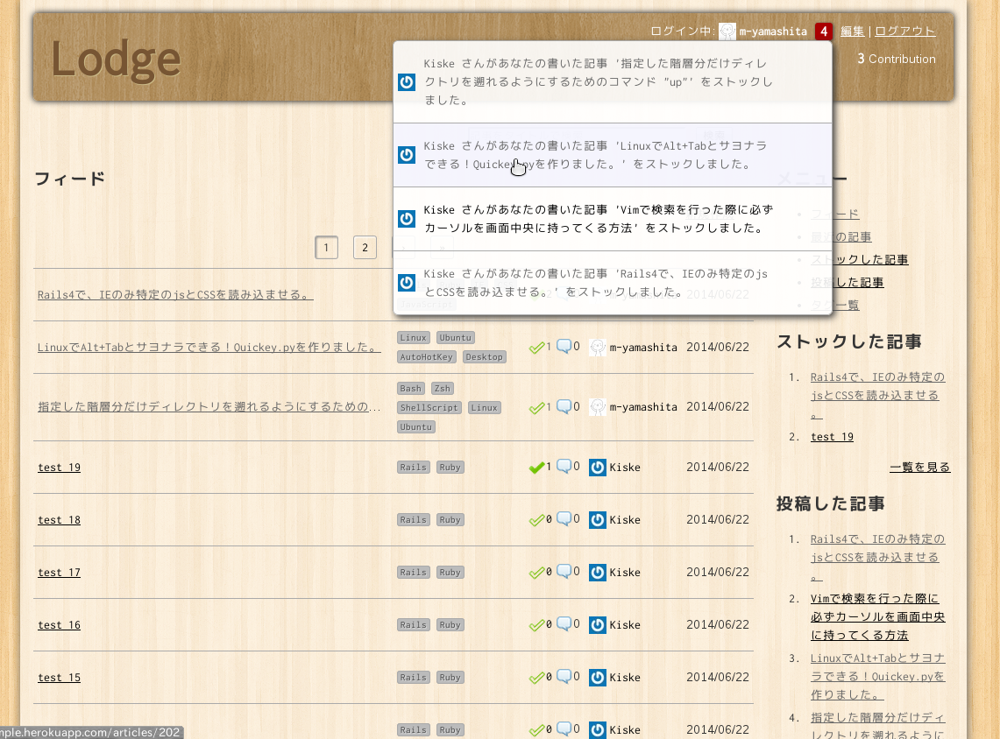
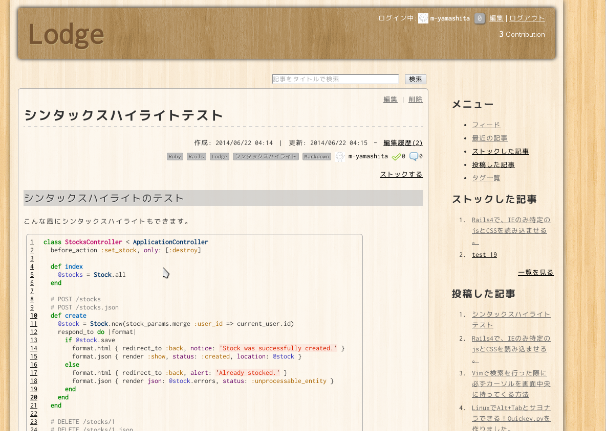

Lodge [](https://gitter.im/lodge/lodge) [](https://travis-ci.org/lodge/lodge)
=====

## これは何？

ロッジと呼びます。
__イントラネット限定でも使える、ナレッジ/ノウハウ情報共有サービス__です。
手軽に導入できて、チーム内全体の情報共有やナレッジ蓄積の手助けができることを目標としています。

## 主な特徴

以下のような特徴を持ちます。

- **無料、OSS、MIT License**
- イントラネット内での構築が可能なので、社外秘な情報を含むナレッジやノウハウの共有に利用可能。
- Markdown記法による直感的かつ簡単な記述でサクサク書ける
- コードのシンタックスハイライト機能
- 投稿前に確認できるプレビュー機能
- ストック機能により、お気に入りの記事やあとで見たい記事等を手軽に保存
- 記事に複数のタグをつけて管理
- タグをフォローすることによる個人ごとのフィードのカスタマイズ表示
- 記事タイトルによる簡単な検索
- 導入までの手軽さ(すぐにインストールできます)
- コメント、Contribution、通知機能等によるコミュニケーションやナレッジ共有活動の活性化
- 編集履歴機能により記事の変更点を差分表示
- メールアドレスだけで誰でも簡単にアカウント作成が可能
- Gravatarと連携したユーザアイコン(登録メールアドレスから自動取得)

上記以外にもまだまだ新機能開発や改善を行っていく予定です。皆様のご協力をお願い致します。

## スクリーンショット

一覧画面



記事閲覧画面



## デモ

以下のURLから、実際に体験できます。

http://lodge-sample.herokuapp.com/

お試し用のユーザ名は以下、パスワードは全て `password` でログインできます。

- `user01@example.com`
- `user02@example.com`
- `user03@example.com`
- `user04@example.com`
- `user05@example.com`

また、新規ユーザ登録もメールアドレスから行えます。

※但し、上記サイトは自体はpublicなので、ご登録の際にはご注意ください。

## インストール

1. 事前準備として以下が必要ですので、インストールしておきます。
    - Ruby 1.9以上
    - Gem 2.2以上
    - MySQL (MySQLを利用する場合)
    - sqlite3 (sqlite3を利用する場合)

1. まずは本プロジェクトをcloneしてきます。

    ```bash
    git clone https://github.com/m-yamashita/lodge.git
    ```

1. `config/database.example.yml` を `config/database.yml` としてコピーし、以下のように編集します(SQLite3もしくはMySQLをご利用になる場合はコメントアウトを外して設定すると楽です)。

    ```yml
    default: &default
    #  # === sqlite3 ===
    #  adapter: sqlite3
    #  encoding: utf8
    #  pool: 5
    
      # === mysql ===
      adapter: mysql2
      host: localhost
      username: your_mysql_user_name
      password: your_mysql_password
      encoding: utf8
      pool: 5
    ```

1. `bundle install` を実行します。
1. `rake db:create RAILS_ENV=production` の後、 `rake db:migrate RAILS_ENV=production` を実行します。これでDBは完成です。
1. `.env.example` を `.env` としてコピーし、必要な環境変数を設定します。各コメントを参考に設定してください。

    ```ruby
    # productionモードで動かす為には、secret_keyを設定します。
    # `rake secret` により生成するのがオススメです。
    SECRET_KEY_BASE   = __some_random_string__

    # 認証キーの設定
    # ランダムな文字列を指定します。
    DEVISE_SECRET_KEY = __some_random_string__

    # アプリケーションのドメインを設定します。
    LODGE_DOMAIN      = lodge-sample.herokuapp.com

    # メールの設定します。
    SMTP_ADDRESS      = smtp.gmail.com
    SMTP_PORT         = 587
    SMTP_USERNAME     = username
    SMTP_PASSWORD     = password
    ```

## 起動

`rails server -e production` を叩けばOKです。
サーバが立ち上がり、Lodgeが利用できるようになります。

※Apache+Passengerや、nginx+Unicorn等でも起動できますので、より高速に動かしたい場合等はそちらをオススメします(設定方法等は割愛)。

## Vagrant up

[VirtualBox](https://www.virtualbox.org/) と [Vagrant](http://www.vagrantup.com/) を使って、
``vagrant up`` することで、VM上に手早く開発環境を用意することができます。

### 手順

1. VirtualBox をインストール
1. Vagrant をインストール
1. ``vagrant plugin install vagrant-vbguest``
1. ``vagrant plugin install vagrant-librarian-chef``
1. ``vagrant plugin install vagrant-vmware-fusion``
1. ``vagrant plugin install vagrant-gatling-rsync``
1. ``vagrant plugin uninstall vagrant-vmware-fusion``
    * vagrant-gatling-rsync をインストールするために必要だが、VMWare のライセンスを持っていないとエラーになるため削除します
1. ``git clone https://github.com/m-yamashita/lodge``
1. ``cd lodge``
1. ``vagrant up``
1. VMが起動するまで待つ
1. ``vagrant gatling-rsync-auto``
    * ホスト上の ``git clone`` したソースコードを自動的にVM上の ``/vagrant`` に同期するために必要です
    * ``vagrant rsync-auto`` がなぜか ``rsync__exclude`` を使ってくれないため、 ``vagrant-gatling-rsync`` を利用します
    * [公式ドキュメントのNFSの項目](https://docs.vagrantup.com/v2/synced-folders/nfs.html) に書かれていますが、VirtualBox の共有フォルダはパフォーマンスが悪いため使用していません。

      > In some cases the default shared folder implementations (such as VirtualBox shared folders) have high performance penalties. 

1. http://localhost:3000/ にアクセスして Lodge の画面を見ることができたら成功です

### 諸々の情報

* アクセス URL
    * http://localhost:3000/
* DB
    * MySQL
* メールサーバ
    * VM 内の Postfix
* Lodge の起動スクリプト
    * ``/etc/init.d/lodge`` （Unicorn を起動）
* RAILS_ROOT
    * ``/vagrant``
* RAILS_ENV
    * ``development``
* ログ
    * ``/vagrant/log/unicorn.stdout.log``
    * ``/vagrant/log/unicorn.stderr.log``

## 最後に

### 開発にご協力頂ける方を募集しています。

まだまだ拙いLodgeの開発を手助けしていただける方を大募集中です。
新機能の開発や改善はもちろん、ソースのリファクタリングからテストの記述、
果てはマニュアル改善まで、どうぞ遠慮無くpull request頂ければと思います。
